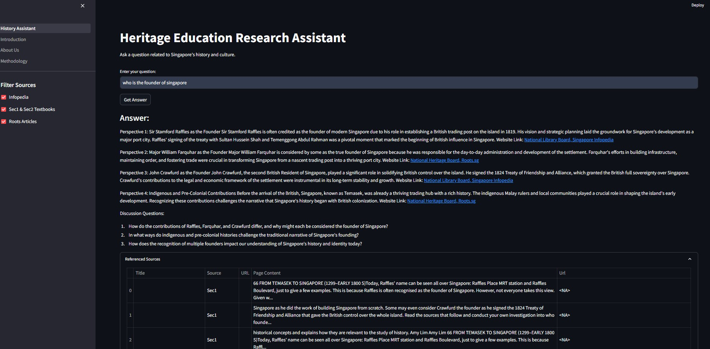
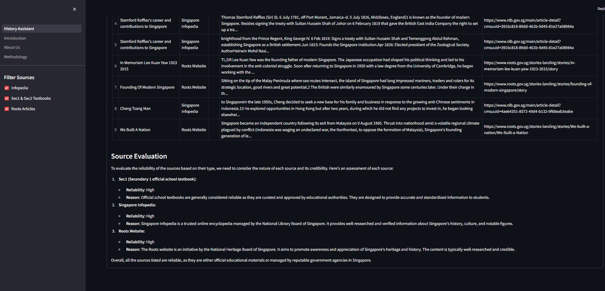

# history-teacher-asst

This is a History Teaching Assistant.

User will input a query about a certain topic " who is the founder of singapore?"
Searches through a vectordb containing a large corpus of information from Roots, infopedia and school textbooks to generate lesson plans with citations.

Deployed on ECS Fargate on AWS.

- **sec1&2 pdf** - PDF files of the textbooks
- **Data Exploration.ipynb** - Initial data exploration
- **.env** - Initial env files (not committed per `.gitignore`)
- **faiss_index** - Contains files of vectorDB FAISS of the sec1&2 textbooks
- **VectorDB Creation.ipynb** - Vector database creation and testing
- **requirements.txt** - for reference.

### How to run the app main.py
Run the following command in your project directory:
1. Create virtual env ( do not repeat this step if u alr have a virtual env folder)
```bash
python -m venv venv
```

2. activate virtual env if needed ( on git bash ) virtual env is activated if u see (venv)
to activate virtual env on git bash, run the command
```bash
source ./venv/Scripts/activate
```
3. run another command in git bash terminal

```bash
pip install -r requirements.txt

```
4. run generate_vectordb.py to generate the faiss vectordb (do not repeat this step if faiss_index_infopedia alr generated)
ensure you got a .env file with OPENAI_API_KEY variable defined. get the key from me if dont have. 

5. run the below command in Bash to start the application locally

```bash
streamlit run History_Assistant.py
```
## Application UI



